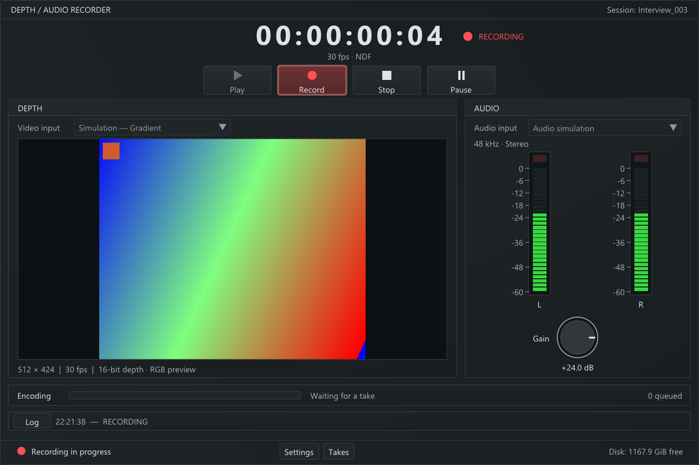

# Kinect Audio Recorder

A Windows interview recorder with Kinect v2 depth capture, WASAPI audio and hardware-free audio/depth simulation. The capture core, simulators, file writers, and CLI use **C++11** and CMake. The desktop interface uses **Dear ImGui + GLFW**. Embedded playback, synchronization fitting and the XML editing workflow remain future work.

## Build on Windows

Requirements: Visual Studio 2022 with the C++ desktop workload/Windows SDK, CMake 3.21+ for presets, and Git for Windows. Rebuilding FFmpeg separately also uses Git Bash and Windows `curl.exe`/`tar.exe` (with xz/zstd support). The GUI build fetches pinned Dear ImGui and GLFW revisions on its first configuration.

For a clean recorder build and a ready-to-commit Windows x64 package:

```powershell
.\build_release.bat
.\release\audio_recorder.exe
```

`build_release.bat` works from any working directory. It deletes only `build/release/`, fetches the pinned GUI sources again, and compiles the recorder executables with static runtimes. It **reuses `release/extern/ffmpeg/` without rebuilding or replacing it**, then runs CTest, CLI/hidden-window GUI simulation and bundled-video export checks before updating the recorder package. Internet access and an OpenGL 3.3-capable graphics driver are required for this clean recorder build. Python 3 is optional for the additional file, codec and package-relocation tests.

To rebuild **only FFmpeg**, run:

```powershell
.\rebuild_ffmpeg.bat
```

This separate script cleans only `build/ffmpeg-rebuild/`, compiles the pinned minimal FFmpeg from scratch, checks a lossless depth-video round trip, and updates `release/extern/ffmpeg/` plus its entries in `release/SHA256SUMS.txt`. It does not rebuild the recorder. FFmpeg and GNU Make downloads are verified by SHA-256 and reused from `build/downloads/`. Run this when changing FFmpeg's version/build profile, or when its packaged binary/source files are missing. The recorder build reports a missing FFmpeg package before cleaning or compiling; it never starts an implicit FFmpeg rebuild. To rebuild everything, run `rebuild_ffmpeg.bat` followed by `build_release.bat`.

`release/` contains the two recorder executables, a usage guide, license notices, SHA-256 checksums, and `extern/ffmpeg/` with the encoder, licenses, exact source archive and build recipe. It is tracked normally by Git; neither script stages files, commits, or pushes. Existing release files are only updated after the relevant compilation and checks succeed. Other files in `release/`, including recordings, are preserved; `release/recordings/` is ignored. Close running executables before rebuilding them so Windows permits replacement. Edit `packaging/README.md` to change the generated usage guide. Intermediate builds, downloaded dependencies, and test recordings stay under ignored `build/`.

For incremental development builds:

```powershell
cmake --preset windows
cmake --build --preset windows --parallel
ctest --preset windows
.\build\windows\Release\audio_recorder.exe
```

The English Dear ImGui interface follows the supplied [GUI concept](documentation/recorder-gui-concept.png): transport and timecode above a large RGB depth preview and vertical audio meters, with encoding, journal and disk space below. On first launch it defaults to simulation. Choose the audio/video inputs, press **Record**, then **Stop**. **Settings** contains the take path prefix (default `recordings/take`) and other capture options. Each new take appends local date/time down to milliseconds, for example `recordings/take-2026-09-17_10-02-44-872`. Previous takes are preserved. **Takes** and **Log** expose the saved path. No hardware is required for simulation.



## Gain, transport and saved settings

The **Gain** knob applies **-24 to +36 dB** of software gain to all channels **before WAV storage and metering**. Drag it, use the wheel, or edit the numeric value; double-click resets it to 0 dB. It remains adjustable while recording. Short ramps soften live changes, and red indicators warn at 0 dBFS. Float32 files retain values above full scale without hard clipping; reduce gain to avoid clipping during playback. This does not change Windows microphone volume or audio enhancements. CLI equivalent: `record --gain-db 30 ...`.

**Pause / Resume** suspends and resumes storage within the same take. Audio and depth devices stay open; samples and images received during the pause are discarded, and the stored-audio timecode stops after pending writes drain. Pause/resume events and resumed packet/frame boundaries are journaled. Native Kinect timestamps remain unchanged, so the silent RGB review holds the last image over a pause. **Play** opens the last completed `video/preview-rgb.mkv` in the associated external player. It becomes available after encoding; in-app playback and synchronized preview sound are not implemented.

The GUI automatically saves **`recorder.ini` beside the executable** (normally `release/recorder.ini`), after edits settle and on exit. It remembers the audio endpoint ID/name, video source, gain, session name, output prefix, duration/rotation, capture policy, simulation parameters, encoding options, last take and window size/maximized state. Missing selected microphones remain selected and report an error rather than switching inputs. Relative paths are anchored to the INI directory, so the launch directory does not change the output location.

A starting file is shipped as **`recorder.example.ini`**. Manual edits use UTF-8 and take effect on the next launch; unknown keys are retained, and invalid individual values are reported in the journal. `audio_recorder --config PATH.ini` selects another configuration. The CLI uses its explicit arguments independently. Rebuilds preserve the personal INI and update only the example; neither the personal INI nor recordings belong in Git.

Capture **continues with warnings by default** after audio discontinuities, invalid timestamps, transient audio/Kinect read failures or a full acquisition queue. Warnings appear in **Log** and `timing/events.jsonl`; the manifest includes their count and policy. Stop drains and finalizes available data. Missing samples/images are not invented, so warnings still matter for later synchronization. Enable **Settings > Stop on capture errors (strict)** or CLI `--strict` to restore fail-fast acquisition. Invalid startup settings, unavailable devices during initial preparation and disk write failures remain errors.

A large elapsed timecode stays visible at the top: `HH:MM:SS:FF`, at **30 fps non-drop**. It follows the stored audio sample count, keeps the final value after Stop, and resets for each new recording.

The **Video input** selector defaults to a simulated moving gradient; noise, audio-only and **Kinect v2 — Sensor** modes are also available. The GUI previews the latest stored depth image in RGB, preserving its aspect ratio. Simulation uses 512 x 424 uint16 millimetres at 30 Hz, driven by the audio sample timeline. Physical Kinect capture retains independent native timestamps.

## Kinect v2 capture on Windows

Install the [Microsoft Kinect for Windows SDK 2.0](https://www.microsoft.com/en-us/download/details.aspx?id=44561), including its runtime and drivers. Follow Microsoft's installation instructions, then connect the powered Kinect v2 to USB 3.0. Configure/build for Windows x64 after installation; CMake detects the SDK through `KINECTSDK20_DIR` or its standard installation path. An explicit path can be supplied with `-DKINECTSDK20_DIR="C:/Program Files/Microsoft SDKs/Kinect/v2.0_1409"`. `-DRECORDER_ENABLE_KINECT=OFF` produces a build without sensor support.

```powershell
cmake --preset windows
cmake --build --preset windows --parallel
.\build\windows\Release\recording_tool.exe kinect-info
.\build\windows\Release\recording_tool.exe record --depth kinect --source wasapi --output recordings\kinect-test --duration 10
```

In the GUI, choose **Kinect v2 — Sensor** under **Video input** and the desired microphone under **Audio input**. Windows inputs use WASAPI; **Default Windows input** follows the default endpoint at the start of each take. Real-time simulated audio can also accompany physical depth for testing. The Kinect runtime is loaded only when selected.

Native depth is stored without resampling or clamping, with sensor ID, depth intrinsics, reliable-distance limits, sensor timestamps and host receipt observations. Startup waits up to 15 seconds for a frame; a five-second stream stall produces a warning and retries while the other stream continues. Native depth segments rotate on sensor time and **do not pair by filename with audio segments**. Silent RGB review videos are available for physical capture; synchronized archival audio/depth export still needs a resolved timing solution. See [Kinect implementation and format](documentation/kinect-implementation.md).

## Troubleshooting

### Kinect v2 repeatedly disconnects on Windows 11

**Disable audio enhancements on the Kinect microphone.** On the development PC,
Windows Voice Clarity was associated with that input. The user confirmed that
turning audio enhancements off resolved the repeated disconnections on
17 September 2026.

The observed symptoms were:

- The Kinect light went off and on while the adapter's power light stayed on.
- Windows logged recurring USB removals: event **1010** in
  `Microsoft-Windows-Kernel-PnP/Device Management`.
- Disconnects were about **16.26 seconds apart** on average across 12 measured
  intervals; this is an observed cycle, not a fixed Kinect timeout.
- Depth capture had long gaps, and microphone audio stopped after about six seconds
  with `0x88890004` (`AUDCLNT_E_DEVICE_INVALIDATED`).
- A second Kinect on the same adapter, cable and USB port showed the same problem.

To apply the confirmed fix:

1. Stop the current recording.
2. Open **Windows Settings > System > Sound > Input**.
3. Select **Microphone Array (Xbox NUI Sensor)**. A replacement Kinect may appear
   as **Microphone Array (2- Xbox NUI Sensor)**.
4. Set **Audio enhancements** to **Off** (French: **Améliorations audio > Désactivé**).
5. Start a new recording of at least **45 seconds** and check that the sensor stays
   on and both audio and depth continue throughout the take.

This setting belongs to the selected audio endpoint: check it again after changing
Kinect sensors. The recorder does not change this Windows setting automatically.
Continuing with warnings keeps a take running but does not prevent USB disconnects
or restore missing data from an earlier take.

Related guidance: [Kinect disconnect loop and Windows audio enhancements](https://ar-sandbox.eu/docs/kinectsandbox-software/troubleshooting/).

### Microphone rejected as an unsupported mono/stereo format

Older builds rejected audio inputs with more than two channels. With audio
enhancements disabled, the Kinect microphone on the development PC exposes
**4 channels at 16 kHz, float32**. Keep enhancements **Off** and use the updated
recorder, which accepts **1 to 32 input channels**. Choose the Kinect microphone under **Audio input** and start a new take. The audio
panel shows the sample rate and one meter per channel; **Log** identifies the
actual input used.

All channels are stored in their original order in a single multichannel WAV;
they are not mixed down to mono/stereo. If a player cannot play that layout,
open the WAV in an audio editor that supports multichannel files.

## RGB review videos

**Settings > Create RGB preview after Stop** is enabled by default in the GUI for both Kinect and simulated depth. Once the take is finalized, the encoding queue creates **`video/preview-rgb.mkv`**, combining all depth segments. Open it in a player supporting FFV1/Matroska, such as VLC. **Takes > Export RGB preview** also accepts an earlier take folder and queues the same export. Existing videos are never overwritten.

```powershell
.\release\recording_tool.exe export-preview --input release\recordings\take-2026-09-17_10-14-55-323
# Optionally choose --output VIDEO.mkv and/or --ffmpeg PATH.
.\release\recording_tool.exe record --depth kinect --duration 20 --timestamp-output --output recordings\review --encode-preview
```

The 512 x 424 video uses exactly the GUI palette: blue near, green midway, red far (500..6000 mm), with invalid zero values in black. It is a colorized depth image, not the Kinect color camera. FFV1 stores these RGB colors losslessly (`bgr0`); the original uint16 depth files remain unchanged. Encoding streams images to FFmpeg without an intermediate raw video file.

The preview is **silent**. Kinect review timing uses host receipt timestamps relative to the first depth image, rounded to a 30 fps playback grid; simulation uses its sample timeline. Gaps hold the last image, and the video ends one playback frame after the last stored image. Multiple arrivals in one playback slot retain the latest image. Sensor-clock resets do not collapse pauses. This is a visual review, not a calibrated synchronization export. Encoding runs after Stop on the existing background queue; a new take can begin while it finishes.

**Settings > Encode simulated segments to Matroska** is enabled by default in the GUI. Each closed depth/audio pair is queued as `video/000000.mkv`, etc. One worker runs one FFmpeg process at a time, at reduced CPU priority with two codec threads. The queue bar counts completed jobs across takes; the journal reports failures. Stop requests capture finalization without waiting for encoding; you can start another take as soon as capture finishes. Closing the window drains the queue with the interface still responsive. The raw recordings are always retained.

## Command line

```powershell
# Real-time simulated audio, with a tone and an audible marker every second.
.\build\windows\Release\recording_tool.exe record --output recordings\test --duration 10

# Deterministic stereo sine test, generated as fast as the writer can accept it.
.\build\windows\Release\recording_tool.exe record --output recordings\stereo --duration 65 --channels 2 --signal sine --fast

# Discover Windows inputs, then capture the default one until Ctrl+C.
.\build\windows\Release\recording_tool.exe devices
.\build\windows\Release\recording_tool.exe record --source wasapi --output recordings\microphone --duration 0
```

Use `--device "<endpoint ID>"` to select a specific microphone. WASAPI retains the endpoint's shared-mode sample rate (8 to 192 kHz) and all input channels (1 to 32), displayed in the GUI and saved in the manifest. Float32 and integer PCM 8/16/24/32-bit inputs are supported; storage is float32 without resampling or downmixing. It does not silently switch devices. Simulation remains mono/stereo. `--help` lists simulation and file-rotation options. Existing take directories are never overwritten.

An explicit CLI `--output` remains an exact directory. Add `--timestamp-output` to use it as a reusable prefix, e.g. `record --output recordings/interview --timestamp-output --depth kinect --source wasapi --duration 10`. Warning-only takes return exit code 0; errors still return nonzero.

## Simulated depth and lossless video

```powershell
.\release\recording_tool.exe record --output recordings\depth-test --duration 10 --depth gradient

# Capture and automatically encode each finished segment in the background.
.\release\recording_tool.exe record --output recordings\auto-test --duration 65 --depth gradient --encode-depth

# Uses the bundled FFmpeg: export one depth segment with its matching audio.
.\release\recording_tool.exe export-depth --input recordings\depth-test\depth\000000.kd16 --audio recordings\depth-test\audio\000000.wav --output recordings\depth-test\depth-video.mkv
```

Use `--depth noise` for animated noise, or `--depth off` for audio only (the CLI default). Native recording uses raw 16-bit segments and timing journals; **FFV1/gray16le in Matroska** preserves depth values exactly. The CLI opts into background encoding with `--encode-depth` and waits for the queue before exiting; `--ffmpeg PATH` selects an encoder for that queue or for manual export. Export prefers `extern/ffmpeg/ffmpeg.exe` relative to the recorder executable, then PATH. The Windows release includes a minimal FFmpeg 9.0.1 for FFV1/rawvideo/PCM, with its LGPL notices and complete corresponding FFmpeg source. See [its build recipe and provenance](extern/ffmpeg/README.md). Export validates one finalized segment at a time and never overwrites an existing output. See [the depth implementation](documentation/depth-implementation.md) for timing, format, measurements and limitations.

## Portable build without GUI dependencies

```sh
cmake -S . -B build/cli -DRECORDER_BUILD_GUI=OFF -DCMAKE_BUILD_TYPE=Release
cmake --build build/cli --config Release --parallel
ctest --test-dir build/cli -C Release --output-on-failure
```

The core build requires CMake 3.16+ and a C++11 compiler, with no downloaded libraries. On non-Windows systems this milestone provides simulation, the CLI, and file writing; hardware audio capture is currently Windows-only. Python 3 is optional for the independent file-validation tests and is never an application runtime dependency. Portable code paths still need qualification on Linux/macOS; local validation was performed on Windows.

## Recording files

Each take contains `manifest.json`, `checkpoint.json`, segmented `audio/*.wav` files, and `timing/*.jsonl` journals. Audio is uncompressed IEEE float32 PCM, rotated every 60 seconds by default. Multichannel WAVs use WAVEFORMATEXTENSIBLE with the source channel mask; an unspecified microphone array layout stays unspecified. Longer configured segments are shortened when necessary to stay within the 4 GiB RIFF limit, with a logged warning and the effective `segment_seconds` in the manifest. Packet metadata preserves sample positions, native timing, receipt-clock observations, and error flags for future Kinect synchronization.

Depth-enabled takes additionally contain `depth/*.kd16` and `timing/depth-frames.jsonl`. Simulated depth rotates with audio, and its last frame can extend less than one video frame beyond the audio end. Kinect depth rotates independently on the sensor timeline; its journal is authoritative. Stored audio includes the selected software gain; native source timing is retained.

See [the implemented audio milestone](documentation/audio-implementation.md) for format details, tests, and current limits, and [the design documentation](documentation/README.md) for the complete planned tool.
