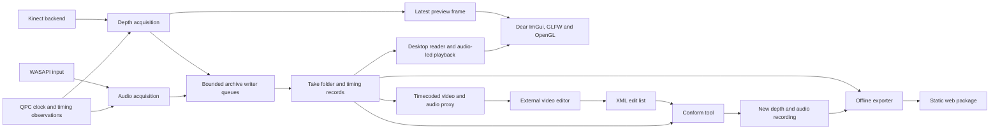

# Product and architecture specification

Version: **0.2 proposal**. Date: **16 September 2026**.

Implementation update, 17 September: physical depth acquisition now uses [Microsoft Kinect SDK 2.0](kinect-implementation.md). References below to `sensor_freenect2` describe the earlier proposal; the current backend is `kinect_depth_source`. The full playback/export and calibrated synchronization requirements remain targets.

This document specifies a Windows tool for recording interviews as depth-based point clouds with external microphone audio, and exporting them for on-demand browser playback. Technology rationale is in the [feasibility study](feasibility.md); timing and storage semantics are in [synchronization and recording format](synchronization-and-format.md).

“Must” identifies an initial release requirement. Numeric performance thresholds are proposed acceptance targets that require hardware validation.

## 1. Scope

### Initial release

- Capture one Kinect v2 depth stream at native 512 × 424 resolution and nominal 30 Hz.
- Capture one selected Windows audio input, with one or two selected channels; request 48 kHz when supported and record the actual negotiated format.
- Display a ghostlike point-cloud preview and microphone level meters.
- Record, stop, replay, pause playback, seek, and organize takes locally.
- Preserve calibration, timing observations, stream discontinuities, and capture settings.
- Adjust segmentation and visual appearance without overwriting the master recording.
- Export a static web publication with synchronized interactive point-cloud playback.
- Render timecoded video proxies with synchronized audio and a configurable fixed camera from the command line.
- Import an XML edit list and produce a self-contained, edited Kinect depth/audio recording using the original masters.

### Deferred features

RGB/IR recording, skeleton tracking, multiple sensors, live broadcasting, multitrack audio interfaces, network clock synchronization, full 360-degree reconstruction, a built-in video editing timeline, and mobile-browser qualification are outside the initial release. Editing compatible takes through external video software and XML interchange is included; transitions, retiming, and independent audio edits are deferred. Recording pause is deferred: Stop followed by Record creates a new take. Playback pause is required.

## 2. Operator workflow and interface

### Setup

The operator selects the Kinect by serial number, an audio endpoint by persistent device identifier, channels, output directory, expected take duration, and archive precision profile. The application shows the actual audio format, available disk space, device readiness, depth frame rate, and timing status.

A Dear ImGui workspace inside one GLFW window contains the point cloud, audio peak/RMS meters with clipping indication, a title field, Record and Stop controls, and a status strip. A side panel provides the take library and capture settings. Keyboard shortcuts must cover Record, Stop, and playback without allowing accidental duplicate starts. Use the standard GLFW/OpenGL3 ImGui backends, an OpenGL 3.3 core context, and DPI-aware font/control sizing.

Before enabling Record, the application must obtain valid frames and valid audio timing for a warm-up period, initially five seconds. It must check write access and space against the uncompressed estimate plus headroom. A short device test should expose microphone permission failures, unavailable endpoints, missing drivers, and unsupported sensor processing pipelines through actionable messages.

The subject sits or stands within a selected capture volume. Offer an empty-scene background capture and a live mask preview. Near/far limits and a rectangular crop are always available; background subtraction is optional.

### Recording

Record establishes one session origin on the shared host timeline. The streams are already running; the button does not attempt simultaneous hardware startup. Audio packets and depth frames crossing the start boundary retain their original timing, with exact trimming deferred to playback/export.

During recording, show elapsed time, microphone levels, disk-space projection, depth capture rate, dropped-frame count, audio discontinuities, and writer backlog. Distinguish preview frame skipping from lost recorded frames.

Changing endpoints, archive precision, or processing backend requires stopping the take. Camera angle, point size, and display color can change without affecting recorded depth. Audio monitoring is optional and off by default; when enabled, its latency must not be used as the recording synchronization reference.

Stop records a common end time, accepts outstanding packets for the recorded interval, drains queues, closes files, and commits indexes. The UI shows Finalizing until completion. A take must never be labelled Complete before its files and metadata are consistent.

### Library and playback

Each take has a stable ID, title, recording date, duration, participant label, tags, notes, thumbnail, and status: Recording, Complete, Interrupted, or Recovered. Sort/filter by date, title, and tags. Opening the containing folder and editing metadata are required. Store the library in per-take manifests; a database is unnecessary initially.

Playback provides Play/Pause, Stop, a seek bar, elapsed/remaining time, volume, camera reset, point size, color, opacity, and crop/background settings. Stop returns to the take's start. Playback works without the Kinect connected. Show capture gaps rather than hiding them by shortening the timeline.

Use a default near-frontal view and limited orbit controls. Reset View restores the intended portrait composition. Large rotations may expose uncaptured surfaces and are not a promise of complete geometry.

## 3. Capture and rendering requirements

| ID | Requirement |
| --- | --- |
| CAP-01 | Sensor and audio acquisition must run independently of GUI redraw, file compression, and network activity. |
| CAP-02 | Preserve native timestamps, sequence/sample positions, and host observations before expensive application processing. |
| CAP-03 | Capture must use bounded queues and preallocated/reused buffers. A slow preview must not back-pressure acquisition. |
| CAP-04 | Every known dropped frame, audio gap, timestamp error, and device reset must be recorded with a reason and interval or uncertainty. |
| CAP-05 | Record actual device IDs, negotiated formats, backend, calibration, application build, and dependency revisions. |
| CAP-06 | Default to full depth without destructive foreground masking. Derived masks and crops belong to editable presentation settings. |
| CAP-07 | Support uint16 millimetre depth and an optional float32 preservation profile. Identify quantization explicitly. |
| CAP-08 | Write microphone PCM without lossy encoding during capture. Float32 storage does not imply a 32-bit ADC. |

The archive depth grid is the decoded camera grid, with a defined orientation and distortion state. Store sufficient calibration to undistort it later. Invalid, missing, and out-of-range values must not become valid foreground points.

The renderer constructs positions from calibrated depth. Use a static pixel grid and depth textures or reusable vertex buffers; do not construct a new high-level object for each point on each frame. Preserve units, handedness, pixel centers, and transforms consistently between desktop and web. Validate reference points against the selected SDK's deprojection. The libfreenect2 [registration implementation](https://github.com/OpenKinect/libfreenect2/blob/fd64c5d9b214df6f6a55b4419357e51083f15d93/src/registration.cpp) provides an implementation reference.

The initial look uses an untextured light-colored cloud on a dark background, with adjustable point size and opacity. A depth crop, background model, and optional conservative spatial cleanup isolate the person. Avoid strong temporal smoothing by default: it can delay moving contours relative to speech. Any temporal filter must declare its effective delay in the export recipe and timing calculation.

## 4. Native architecture



Proposed build targets:

| Target | Responsibility |
| --- | --- |
| `recorder_core` | Session state, clocks, buffer ownership, stream contracts, diagnostics. |
| `sensor_freenect2` | Sensor enumeration, configuration, frames, calibration, timestamp observations. |
| `audio_wasapi` | Endpoint selection, capture positions, PCM buffers, playback clock. |
| `recording_io` | Versioned files, indexes, recovery, validation, metadata. |
| `pointcloud_renderer` | Depth reconstruction, crop/mask, visual parameters. |
| `recorder_gui` | Dear ImGui workflow, GLFW window/input, and operator-facing diagnostics. |
| `recording_tool` | Command-line inspect, verify, recover, export, render-proxy, and conform operations. |
| `edit_interchange` | XML parsing, source relinking, edit validation, rational time conversion, and normalized edit plan. |
| `sensor_kinect_sdk` | Optional fallback, only if Stage A requires it. |

These names are proposed architecture, not existing binaries or commands.

Proxy rendering reuses the point-cloud renderer with a hidden GLFW/OpenGL context and no ImGui interface. It requires a working graphics context, but neither a connected Kinect nor real-time rendering speed. XML validation and depth/audio conform do not require a GPU. The CLI uses the same archive reader and timing solution as desktop playback.

The main thread owns GLFW event processing, Dear ImGui, and the preview context. Render the point cloud into an offscreen framebuffer and display its texture in the preview panel. Acquisition threads transfer data to bounded queues and return quickly; compression and disk I/O run elsewhere. A latest-frame preview slot can overwrite an older preview frame, but archive buffers have explicit ownership until written or recorded as lost. The render loop must continue processing events when the preview is paused; its vsync rate must never control acquisition.

Begin with a depth queue capacity of two seconds and a separate audio queue of five seconds, configured by byte limits for the selected format. At two-thirds capacity, reduce preview work and report backlog. If sustained overload continues, stop and finalize an Interrupted take while preserving queued data. Do not silently switch depth precision, drop audio, or change the sample rate.

Sensor callbacks must not perform ImGui calls or manipulate the application's GLFW window. WASAPI buffers must be copied into owned storage and released promptly. Avoid capture-thread allocation, compression, unbounded locks, and synchronous log writes. Measure end-to-end frame delivery and writer backlog rather than relying on average CPU usage.

## 5. State and failure behavior

Normal capture transitions are `Idle -> Preparing -> Ready -> Recording -> Finalizing -> Complete`. Errors transition to Finalizing when possible, then Interrupted. Reopening an unfinalized folder triggers recovery inspection. Playback and export operate on completed or explicitly recovered takes.

| Condition | Required behavior |
| --- | --- |
| Kinect or audio input disconnects | End the take, flush surviving data, and record the exact last valid positions. Reconnection starts a new take. |
| Depth frame is missing | Keep the elapsed interval and sequence gap. Playback may briefly hold a frame, then indicate missing geometry. |
| Audio timestamp is flagged invalid | Keep the samples and flag uncertainty; do not feed that observation into the clock fit. |
| Audio data is missing | Preserve a gap record. Only synthesize silence during replay/export, with an explicit duration estimate. |
| Disk full or write failure | Stop acquisition, preserve the valid prefix, and identify the take as Interrupted. |
| Application crash | Recover complete records and intact PCM blocks without depending on a final index. |
| Preview stalls or loses its GL context | Continue capture if its backend remains healthy; report the preview error. |
| Suspend/resume or device clock reset | End the current take; never treat a reset counter as continuous sensor time. |
| Export is interrupted | Keep the master intact and leave the incomplete export distinguishable from a publishable package. |

Process-crash recovery and power-loss durability are separate properties. Checkpoint/flush complete records at least once per second; test recovery. Storage firmware can still prevent an absolute power-loss guarantee. Do not claim that a buffered write is durable solely because the write call returned.

## 6. Web publication

### Export

The exporter reads a master, verifies it, applies a versioned timing solution, selects a time range, undistorts depth, applies crop/mask and spatial density settings, and writes a new package. It must not modify original sensor observations or PCM.

Recommended initial package:

```text
interview-web/
  index.html
  player.js
  depth-worker.js
  depth-decoder.wasm
  manifest.json
  calibration.json
  poster.jpg
  audio.webm
  audio.m4a                # optional alternate encoding
  depth/
    000000.kwd
    000001.kwd
```

Use one continuous compressed audio asset as the initial browser playback source: Opus in WebM, with an AAC/M4A alternate when required by the tested browser set. Select a supported source at runtime and verify actual decoding; do not assume uniform codec support. Keep encoder delay, start offset, and end padding correct for each variant. Independent audio segment encoding is deferred because naive concatenation can introduce gaps.

Depth files contain independently decodable, timestamped frames grouped into roughly one-second chunks. Zstandard compression is decoded in a worker using a pinned WASM build. The manifest indexes chunk time ranges, byte sizes, checksums, precision, dimensions, calibration, and the chosen audio timeline. Chunk lengths are measured durations, not assumptions about frame counts.

Provide at least a full-density profile and a reduced-density profile, retaining nominal 30 Hz for original captures and the declared edit rate for conformed recordings. A 15 Hz profile is optional and must state its lower motion/timing resolution; it must preserve explicit cut boundaries. Profiles share the same media timeline. Never pass numerical depth through ordinary lossy color-video encoding as if it were an exact distance map.

### Player

Use WebGL 2 as the initial rendering baseline. Upload uint16 depth to an integer texture such as `R16UI` and reconstruct geometry in shaders, using nearest sampling for raw depth. Integer texture formats are defined by the [WebGL 2 specification](https://registry.khronos.org/webgl/specs/latest/2.0/).

The first player uses `HTMLAudioElement.currentTime` as its authoritative media position. Each animation callback selects depth from that time; callback frequency is only a rendering opportunity. Do not count animation frames to advance the interview. See the [HTML media timeline specification](https://html.spec.whatwg.org/multipage/media.html#dom-media-currenttime-dev) and the [timing design](synchronization-and-format.md).

Before starting or resuming, buffer audio and geometry around the same position. A provisional policy is three seconds ahead, refilling toward five seconds, with a total decoded-depth memory cap of 128 MiB. Keep compressed downloads in a separate bounded cache. On shortage, pause both timelines at the actual audio position, fetch/decode, and resume together. Known gaps in the master are presentation events, not endless buffering requests.

Seeking must pause audio, invalidate stale fetch/decode results using a seek generation ID, select the target chunk, wait for audio seeking and depth readiness, and resume only when both refer to the new position. After a main-thread stall, jump to geometry corresponding to the current audio time; do not replay a backlog of obsolete frames.

When the page becomes hidden, pause the interview by default. Handle failed autoplay, interrupted audio, network errors, and WebGL context loss explicitly. Resume after a user action when required. If the rendering path is unavailable, offer the exported 2D video or an audio-only mode.

Static hosting must supply correct MIME types, HTTP byte-range support for audio seeking, and CORS headers when assets use different origins. No shared-memory browser feature is required for the initial worker implementation. Serve through HTTP(S), not by assuming `file://` behavior.

### Export quality report

Each package must include or reference a local report containing master ID, application/exporter version, timing solution, offsets, drift estimate, gaps, dimensions, quantization, filter settings, byte size, average/peak chunk bitrate, and validation outcome. Descriptive participant metadata is included in the public package only when selected for publication.

## 7. External video editing and XML conform

The required workflow is `master recording -> fixed-camera video/audio proxy -> DaVinci Resolve -> XML edit list -> new Kinect/audio recording -> desktop or web playback`. The detailed contract and proposed CLI are in [video proxy editing and XML conform](editing-workflow.md).

`recording_tool render-proxy` must produce a constant-frame-rate video with synchronized audio, embedded source timecode, optional visible timecode, and a sidecar mapping its media identity and frames to the master. Camera position, orientation, projection, resolution, and appearance are deterministic render settings. They are baked into the proxy picture, not into the original geometry.

`recording_tool conform` must validate the selected XML sequence, resolve sources, and apply its source in/out and destination positions to both depth and audio. Support trimming, removing, reordering, and repeating intervals from compatible takes, plus explicit timeline gaps. The output is a new, independently playable recording with its own timestamps, calibration, source provenance, and cut boundaries. Reading the edited video cannot recover Kinect geometry; conform always uses the masters and their proxy mappings.

The first XML dialect is Final Cut Pro 7 XML (`xmeml`, version 5), exported from DaVinci Resolve, with a strict cuts-only subset. Qualify actual exports from the installed Resolve version before advertising support. The tool must reject unsupported semantic operations with a clip-specific report; it must not silently approximate a dissolve, speed change, nested sequence, or detached audio edit. Derived frames use explicit editorial display intervals, so the closest-frame selection used for capture playback cannot advance a cut by half a frame.

## 8. Acceptance criteria

The initial qualification matrix must record the actual Windows build, sensor/adapter, USB driver/controller, GPU/driver, audio endpoint, storage device, and browser versions. The following are targets for that measured matrix, not universal guarantees.

| ID | Test | Pass condition |
| --- | --- | --- |
| VAL-01 | Two-hour concurrent capture | Zero lost audio samples under the normal test load; zero unexplained sequence gaps; depth loss below 0.1%, all reported. |
| VAL-02 | Physical A/V reference events near 0, 10, 30, 60, and 120 minutes | After calibration, 95th-percentile absolute alignment error at most 33 ms; no event over 50 ms; start-to-end residual drift at most 20 ms. Report measurement uncertainty separately. |
| VAL-03 | Forced preview stall and CPU/GPU load | Capture remains correct within the qualified load budget; overload causes the specified visible interruption rather than silent corruption. |
| VAL-04 | Disk stall/full, disconnect, and process termination | All checkpointed records are recovered; losses and uncertainty are reported. Under tested storage conditions, uncommitted loss is bounded by one checkpoint interval plus the measured in-flight/queued data. |
| VAL-05 | Timestamp wrap/reset, gaps, and invalid timing observations | Synthetic fixtures retain correct order, epoch boundaries, and elapsed gaps; no backward presentation time. |
| VAL-06 | Desktop seeking | Local indexed seeking settles within 500 ms on the test SSD; audio and geometry use the same target. |
| VAL-07 | Web playback and 100 random seeks | No cumulative drift; steady-state end-to-end alignment at most 50 ms on the qualified 30 Hz browser/output configurations, including codec priming. |
| VAL-08 | Web network throttling and tab suspension | Bounded memory; visible buffering; no persistent desynchronization after resume. Target usable playback at the selected export bitrate plus 25% network headroom. |
| VAL-09 | Geometry round trip | Native and browser reconstruction agree with reference points, units, orientation, and the declared quantization tolerance. |
| VAL-10 | Clean-machine installation and offline replay | Recorder starts with packaged runtime dependencies; archived takes replay without the Kinect or network access. |
| VAL-11 | Video proxy/XML/depth round trip | Selected depth identities, audio intervals, cut order, gaps, and final duration match the edit exactly within declared sample/timestamp rounding; no accumulation of timing error. |
| VAL-12 | Edited recording played without its source folders | The conformed output is self-contained, seeks correctly across cuts, and exports to the existing web player without refitting source clocks. |

Test desktop Chromium/Edge and Firefox first, then Safari on macOS before claiming general desktop-browser support. A browser or audio output path that fails the timing target must be excluded from the qualified set or receive an improved playback implementation. Mobile and high-latency wireless output paths need separate qualification.

Automated coverage should focus on clock conversion, drift fixtures, corrupt/truncated records, gap preservation, timestamp ordering, and seek selection. Hardware endurance runs and perceptual A/V review are indispensable; unit tests alone cannot validate the driver or the audible/displayed timing.
